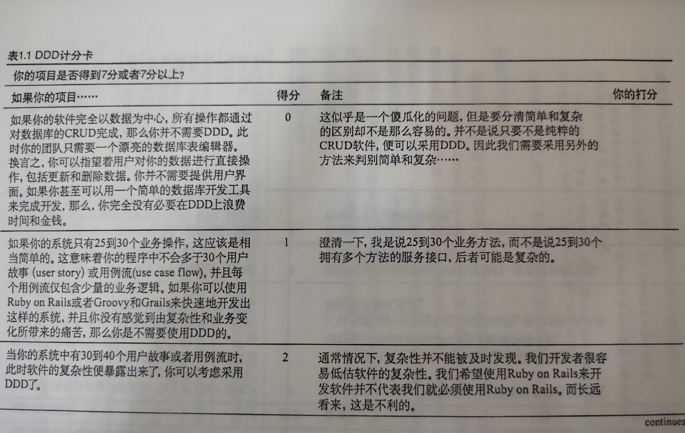
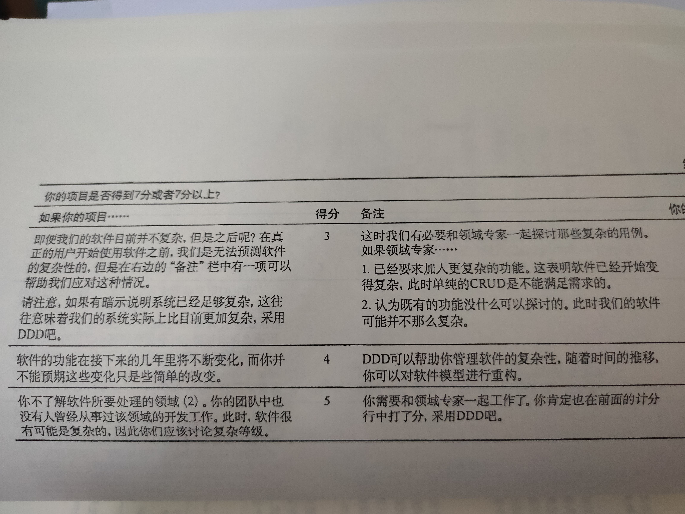

## 1. DDD（领域驱动）介绍、优势劣势及如何评估你的项目是否适合DDD

```
1. 什么是DDD？
2. 学习DDD难吗？
3. DDD是关于技术的吗？
4. DDD优势和劣势?
5. 如何评估你的项目是否适合DDD?
```
#### 1. 什么是DDD？
```
它是一种软件开发方法，也是一种处理高度复杂软件（领域）的设计思想，它试图分离技术实现的复杂性，
并围绕业务概念建立领域模型来控制业务的复杂性，以解决软件难以理解、难以演进的问题，
它通过边界划分将复杂的业务领域简单化，帮助我们设计出清晰的领域和应用边界，可以很容易地实现架构演进，
可以帮助我们设计出高质量的软件模型。
在正确实现情况下，通过DDD完成的设计恰恰就是软件的工作方式
```

#### 2. 学习DDD难吗
```
DDD的学习曲线有可能很陡。
```

### 3. DDD是关于技术的吗？
```go
DDD首先不是关于技术，而是关于讨论、聆听、理解、发现和业务价值，而这些都是为了将知识集中起来。
```

### 4. DDD优势和劣势?

**优势**
```go
1. 简化沟通，减少误解的风险
  早期强调建立通用语言，团队通常会发现在整个开发生命周期中的沟通要容易得多。通常，DDD在讨论应用程序的各个方面时，
  它们需要的技术术语较少，因为通用语言较早建立的术语可能会定义更简单的术语来指代那些技术性更高的方面

2. 更好的团队协作
  领域专家和开发者一起工作，这并不表示单单地包容对方，而是将他们组成一个密切协作的团队。
  
3. 更好的理解
  设计就是代码，代码就是设计。设计是关于软件如何工作的。
  最好的编码设计来自多次试验，这得易于敏捷的发现过程。
  
4. 更好的用户体验
  领域专家和开发者一起工作，这样开发出来的软件能够准确地传达业务规则。
  “准确传达业务规则”意思是说，此时的软件就像领域专家是编码人员时所开发出来的一样。
  
  如果软件留下太多的地方让用户去理解，用户往往需要经过培训才能做出操作决定。实际上，
  用户只是将他们理解的转移到表单中的数据而已。数据被存储起来，如果用户不知道数据的用途，那么结果也将是错误的。
  
  当用户体验是按照领域专家心中的模型来设计时，就不会出现以上的问题了。这时软件本身便能对用户起到培训作用，
  而不需要业务人员来提供培训。效率提高了，培训减少了----这就是业务价值。
  
5. 敏捷、迭代式的持续建模
  设计就是代码，代码就是设计。设计是关于软件如何工作的。
  最好的编码设计来自多次试验，这得易于敏捷的发现过程
  
6. DDD不仅适用于微服务，也适用于传统的单体应用
  无论是在新项目中设计微服务，还是将系统从单体架构演进到微服务，都可以遵循 DDD 的架构原则。
  
7. 更好的企业架构
  DDD的一大好处便是它并不需要使用特定的架构。由于核心域位于限界上下文中，我们可以在整个系统中使用多种风格的架构。
```

**劣势**
```
1.需要领域专家
  DDD项目需要领域专家，因为他们拥有宝贵的知识，所以通常聘用起来很昂贵。

2.创建通用语言预先消耗时间
  我们需要花费大量的时间和精力来思考业务领域、业务边界，研究概念和术语，并且和领域专家交流，以发现、捕捉和改进通用语言

3.学习曲线很陡峭
  DDD最初具有较高的学习曲线。刚开始习惯这种新的思维方式可能会很痛苦

4.仅适用于复杂的应用程序
  仅当域很复杂时，DDD的真正好处才会显现出来。如果域很简单，那么DDD可能是一个过大的杀伤力。

```


### 5. 如何评估你的项目是否适合DDD?




